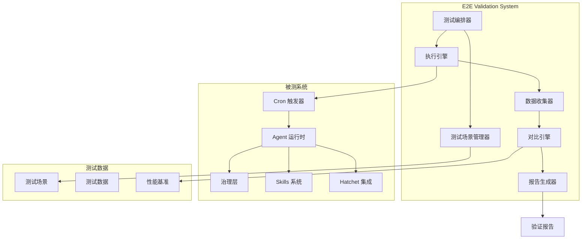

# 设计文档

## 概述

端到端验证系统（E2E Validator）是一个综合测试框架，用于验证 OwlClaw Agent 系统的完整工作流程。该系统通过自动化测试验证从 Cron 触发器到 Agent 运行时、治理层、Skills 系统以及 Hatchet 集成的所有组件的集成正确性。

系统的核心目标是：
1. 验证 mionyee 的三个核心任务能够端到端正确执行
2. 对比 V3 Agent 和原始 cron 实现的决策质量
3. 确保各组件之间的集成可靠性
4. 提供详细的验证报告和性能分析

## 架构

### 系统架构图



### 架构层次

1. **测试编排层**: 负责协调整个测试流程，管理测试生命周期
2. **场景管理层**: 管理测试场景的创建、存储和检索
3. **执行层**: 执行测试场景，与被测系统交互
4. **数据收集层**: 收集执行过程中的所有数据和指标
5. **分析层**: 对比分析测试结果，计算质量指标
6. **报告层**: 生成可视化报告和统计分析

## 组件和接口

### 1. 测试编排器 (TestOrchestrator)

负责协调整个测试流程的核心组件。

```typescript
interface TestOrchestrator {
  // 运行完整的端到端验证套件
  runFullValidation(config: ValidationConfig): Promise<ValidationResult>
  
  // 运行特定的 mionyee 任务测试
  runMionyeeTask(taskId: string, config: TaskConfig): Promise<TaskResult>
  
  // 运行决策质量对比测试
  runDecisionComparison(scenarios: TestScenario[]): Promise<ComparisonResult>
  
  // 运行组件集成测试
  runIntegrationTests(components: ComponentConfig[]): Promise<IntegrationResult>
}

interface ValidationConfig {
  testSuites: string[]
  parallelism: number
  timeout: number
  errorInjection?: ErrorInjectionConfig
  performanceBenchmarks?: PerformanceConfig
}

interface ValidationResult {
  testId: string
  startTime: Date
  endTime: Date
  totalTests: number
  passedTests: number
  failedTests: number
  skippedTests: number
  results: TestResult[]
  performanceMetrics: PerformanceMetrics
  errors: ErrorReport[]
}
```

### 2. 测试场景管理器 (TestScenarioManager)

管理测试场景的生命周期。

```typescript
interface TestScenarioManager {
  // 创建新的测试场景
  createScenario(scenario: TestScenario): Promise<string>
  
  // 获取测试场景
  getScenario(scenarioId: string): Promise<TestScenario>
  
  // 更新测试场景
  updateScenario(scenarioId: string, updates: Partial<TestScenario>): Promise<void>
  
  // 删除测试场景
  deleteScenario(scenarioId: string): Promise<void>
  
  // 列出所有场景
  listScenarios(filter?: ScenarioFilter): Promise<TestScenario[]>
  
  // 验证场景配置
  validateScenario(scenario: TestScenario): ValidationError[]
  
  // 导入/导出场景
  exportScenarios(scenarioIds: string[]): Promise<string>
  importScenarios(data: string): Promise<string[]>
}

interface TestScenario {
  id: string
  name: string
  description: string
  type: 'mionyee-task' | 'decision-comparison' | 'integration' | 'performance' | 'error-injection' | 'concurrent'
  config: ScenarioConfig
  expectedOutcome: ExpectedOutcome
  tags: string[]
  createdAt: Date
  updatedAt: Date
}

interface ScenarioConfig {
  // Mionyee 任务配置
  mionyeeTaskId?: string
  taskParameters?: Record<string, any>
  
  // 决策对比配置
  comparisonMode?: 'v3-agent' | 'original-cron' | 'both'
  decisionCriteria?: DecisionCriteria[]
  
  // 组件配置
  components?: ComponentConfig[]
  
  // 性能配置
  performanceThresholds?: PerformanceThresholds
  
  // 错误注入配置
  errorInjection?: ErrorInjectionConfig
  
  // 并发配置
  concurrency?: ConcurrencyConfig
}
```

### 3. 执行引擎 (ExecutionEngine)

执行测试场景并与被测系统交互。

```typescript
interface ExecutionEngine {
  // 执行单个测试场景
  executeScenario(scenario: TestScenario): Promise<ExecutionResult>
  
  // 执行 mionyee 任务
  executeMionyeeTask(taskId: string, params: TaskParameters): Promise<TaskExecutionResult>
  
  // 执行决策对比
  executeDecisionComparison(scenario: TestScenario): Promise<DecisionComparisonResult>
  
  // 注入错误
  injectError(component: string, errorType: ErrorType): Promise<void>
  
  // 清理测试环境
  cleanup(): Promise<void>
}

interface ExecutionResult {
  scenarioId: string
  status: 'success' | 'failure' | 'error' | 'timeout'
  startTime: Date
  endTime: Date
  duration: number
  trace: ExecutionTrace[]
  outputs: Record<string, any>
  errors: Error[]
}

interface ExecutionTrace {
  timestamp: Date
  component: string
  action: string
  input: any
  output: any
  duration: number
  status: string
}

interface TaskExecutionResult extends ExecutionResult {
  taskId: string
  cronTriggered: boolean
  agentRuntimeProcessed: boolean
  skillsInvoked: string[]
  governanceChecks: GovernanceCheck[]
  hatchetWorkflowId?: string
}
```

### 4. 数据收集器 (DataCollector)

收集执行过程中的所有数据和指标。

```typescript
interface DataCollector {
  // 开始收集数据
  startCollection(executionId: string): void
  
  // 记录组件事件
  recordEvent(event: ComponentEvent): void
  
  // 记录性能指标
  recordMetric(metric: PerformanceMetric): void
  
  // 记录错误
  recordError(error: ErrorEvent): void
  
  // 停止收集并返回数据
  stopCollection(): CollectedData
}

interface CollectedData {
  executionId: string
  events: ComponentEvent[]
  metrics: PerformanceMetric[]
  errors: ErrorEvent[]
  traces: ExecutionTrace[]
  resourceUsage: ResourceUsage
}

interface ComponentEvent {
  timestamp: Date
  component: string
  eventType: string
  data: any
  correlationId: string
}

interface PerformanceMetric {
  timestamp: Date
  component: string
  metricName: string
  value: number
  unit: string
}

interface ResourceUsage {
  cpu: number[]
  memory: number[]
  network: NetworkUsage
  disk: DiskUsage
}
```

### 5. 对比引擎 (ComparisonEngine)

对比分析 V3 Agent 和原始 cron 的决策质量。

```typescript
interface ComparisonEngine {
  // 对比两个执行结果
  compare(v3Result: ExecutionResult, cronResult: ExecutionResult): ComparisonResult
  
  // 计算决策质量指标
  calculateDecisionQuality(result: ExecutionResult): DecisionQuality
  
  // 对比性能指标
  comparePerformance(v3Metrics: PerformanceMetrics, cronMetrics: PerformanceMetrics): PerformanceComparison
  
  // 检测异常差异
  detectAnomalies(comparison: ComparisonResult, threshold: number): Anomaly[]
}

interface ComparisonResult {
  scenarioId: string
  v3AgentResult: ExecutionResult
  originalCronResult: ExecutionResult
  decisionQualityDiff: DecisionQualityDiff
  performanceDiff: PerformanceDiff
  anomalies: Anomaly[]
  summary: ComparisonSummary
}

interface DecisionQuality {
  accuracy: number
  responseTime: number
  resourceEfficiency: number
  errorRate: number
  completeness: number
}

interface DecisionQualityDiff {
  accuracyDiff: number
  responseTimeDiff: number
  resourceEfficiencyDiff: number
  errorRateDiff: number
  completenessDiff: number
  overallImprovement: number
}

interface PerformanceDiff {
  responseTimeDiff: number
  throughputDiff: number
  cpuUsageDiff: number
  memoryUsageDiff: number
}

interface Anomaly {
  type: string
  severity: 'low' | 'medium' | 'high' | 'critical'
  description: string
  affectedMetrics: string[]
  recommendation: string
}
```

### 6. 报告生成器 (ReportGenerator)

生成验证报告和可视化图表。

```typescript
interface ReportGenerator {
  // 生成综合验证报告
  generateValidationReport(result: ValidationResult): Promise<Report>
  
  // 生成决策对比报告
  generateComparisonReport(comparison: ComparisonResult): Promise<Report>
  
  // 生成性能报告
  generatePerformanceReport(metrics: PerformanceMetrics[]): Promise<Report>
  
  // 导出报告
  exportReport(report: Report, format: 'json' | 'html' | 'pdf'): Promise<string>
}

interface Report {
  id: string
  title: string
  generatedAt: Date
  summary: ReportSummary
  sections: ReportSection[]
  charts: Chart[]
  recommendations: string[]
}

interface ReportSummary {
  totalTests: number
  passedTests: number
  failedTests: number
  testCoverage: number
  successRate: number
  averageResponseTime: number
  criticalIssues: number
}

interface ReportSection {
  title: string
  content: string
  data: any
  charts?: Chart[]
}

interface Chart {
  type: 'line' | 'bar' | 'pie' | 'scatter' | 'heatmap'
  title: string
  data: ChartData
  options: ChartOptions
}
```

## 数据模型

### 测试场景数据模型

```typescript
// Mionyee 任务场景
interface MionyeeTaskScenario extends TestScenario {
  type: 'mionyee-task'
  config: {
    taskId: '1' | '2' | '3'
    taskParameters: {
      input: any
      context: Record<string, any>
    }
    expectedFlow: {
      cronTrigger: boolean
      agentRuntime: boolean
      skills: string[]
      governance: string[]
      hatchet: boolean
    }
  }
}

// 决策对比场景
interface DecisionComparisonScenario extends TestScenario {
  type: 'decision-comparison'
  config: {
    scenarios: Array<{
      input: any
      expectedDecision: any
    }>
    comparisonMetrics: string[]
    threshold: number
  }
}

// 集成测试场景
interface IntegrationTestScenario extends TestScenario {
  type: 'integration'
  config: {
    components: ComponentConfig[]
    integrationPoints: IntegrationPoint[]
    validations: ValidationRule[]
  }
}

interface ComponentConfig {
  name: string
  enabled: boolean
  config: Record<string, any>
  mockMode?: boolean
}

interface IntegrationPoint {
  from: string
  to: string
  protocol: string
  expectedBehavior: string
}
```

### 执行结果数据模型

```typescript
interface TestResult {
  testId: string
  scenarioId: string
  status: 'passed' | 'failed' | 'error' | 'skipped'
  startTime: Date
  endTime: Date
  duration: number
  executionTrace: ExecutionTrace[]
  assertions: AssertionResult[]
  metrics: PerformanceMetrics
  errors: ErrorReport[]
}

interface AssertionResult {
  name: string
  passed: boolean
  expected: any
  actual: any
  message?: string
}

interface ErrorReport {
  timestamp: Date
  component: string
  errorType: string
  message: string
  stack: string
  context: Record<string, any>
}

interface PerformanceMetrics {
  responseTime: number
  throughput: number
  cpuUsage: number
  memoryUsage: number
  networkIO: number
  diskIO: number
}
```

## 正确性属性

*属性是一个特征或行为，应该在系统的所有有效执行中保持为真——本质上是关于系统应该做什么的形式化陈述。属性作为人类可读规范和机器可验证正确性保证之间的桥梁。*


### 端到端执行流程属性

**属性 1: Mionyee 任务完整执行流程**

*对于任意* mionyee 任务（任务 1、2 或 3）和任意任务参数，当触发该任务时，执行轨迹应当包含所有必需组件的调用：Cron_Trigger → Agent_Runtime → Skills_System → Governance_Layer → Hatchet_Integration

**验证需求: 1.1, 1.2, 1.3**

**属性 2: 执行轨迹完整性**

*对于任意* mionyee 任务执行，系统记录的执行轨迹应当包含每个组件的输入和输出数据

**验证需求: 1.4**

**属性 3: 验证报告生成**

*对于任意* 完成的 mionyee 任务，系统生成的验证报告应当包含执行时间、状态和结果字段

**验证需求: 1.5**

### 决策质量对比属性

**属性 4: 双系统执行**

*对于任意* 测试场景，当执行决策对比时，系统应当分别使用 V3_Agent 和 Original_Cron 执行，并且两者都产生决策结果

**验证需求: 2.1**

**属性 5: 决策指标完整性**

*对于任意* 决策数据收集，记录的数据应当包含决策准确性、响应时间、资源使用和错误率等所有必需指标

**验证需求: 2.2**

**属性 6: 差异计算正确性**

*对于任意* 两组决策结果，对比引擎计算的差异百分比应当等于 `(v3_metric - cron_metric) / cron_metric * 100`

**验证需求: 2.3**

**属性 7: 对比报告完整性**

*对于任意* 对比数据，生成的报告应当包含可视化图表和统计分析结果

**验证需求: 2.4**

**属性 8: 异常检测**

*对于任意* 决策质量差异，当差异绝对值超过配置的阈值时，系统应当标记异常并提供详细分析

**验证需求: 2.5**

### 组件集成属性

**属性 9: 组件集成链完整性**

*对于任意* 任务执行，当 Cron_Trigger 触发任务时，任务上下文应当正确传递到 Agent_Runtime，Agent_Runtime 应当正确调用 Skills_System 并获取响应，Skills_System 应当通过 Governance_Layer 验证权限，需要编排的任务应当正确使用 Hatchet_Integration

**验证需求: 3.1, 3.2, 3.3, 3.4**

**属性 10: 错误传播和回滚**

*对于任意* 组件和任意注入的错误，当该组件失败时，错误应当被正确传播到调用链，并且回滚机制应当被触发

**验证需求: 3.5**

### 测试数据管理属性

**属性 11: 测试场景 CRUD 往返**

*对于任意* 测试场景，创建场景后读取应当返回等价的场景，更新场景后读取应当反映更新，删除场景后读取应当返回不存在

**验证需求: 4.1**

**属性 12: 场景配置验证**

*对于任意* 测试场景配置，当配置缺少必需字段或包含无效值时，系统应当拒绝创建并返回验证错误

**验证需求: 4.2**

**属性 13: 测试数据隔离**

*对于任意* 测试执行，测试过程中创建或修改的数据应当与生产环境数据隔离，生产数据在测试前后应当保持不变

**验证需求: 4.3**

**属性 14: 测试数据清理**

*对于任意* 测试执行，当测试完成时，所有测试数据和临时资源应当被自动清理，不留残留

**验证需求: 4.4**

**属性 15: 场景导入导出往返**

*对于任意* 测试场景集合，导出后再导入应当产生等价的场景集合

**验证需求: 4.5**

### 验证报告属性

**属性 16: 综合报告完整性**

*对于任意* 验证测试结果集合，生成的综合报告应当包含所有测试结果、测试覆盖率、成功率、失败原因和性能指标

**验证需求: 5.1, 5.2**

**属性 17: 对比报告可视化**

*对于任意* 包含对比数据的报告，报告应当包含至少一个可视化图表

**验证需求: 5.3**

**属性 18: 报告格式导出**

*对于任意* 报告和任意格式（JSON、HTML、PDF），导出操作应当成功并生成有效的格式文件

**验证需求: 5.4**

**属性 19: 失败报告详细信息**

*对于任意* 包含失败测试的报告，报告应当包含每个失败测试的错误堆栈和调试信息

**验证需求: 5.5**

### 性能基准属性

**属性 20: 性能指标收集完整性**

*对于任意* 性能测试执行，系统应当测量并记录端到端响应时间、吞吐量、资源使用以及每个组件的性能指标

**验证需求: 6.1, 6.2**

**属性 21: 性能警告触发**

*对于任意* 性能指标，当该指标超出配置的基准范围时，系统应当发出警告

**验证需求: 6.3**

**属性 22: 基准阈值管理**

*对于任意* 性能基准阈值，系统应当支持设置和更新该阈值

**验证需求: 6.4**

**属性 23: 性能趋势分析**

*对于任意* 性能报告，当存在历史性能数据时，报告应当包含历史趋势分析

**验证需求: 6.5**

### 错误注入属性

**属性 24: 错误注入能力**

*对于任意* 组件和任意错误类型（超时、网络故障、资源不足等），系统应当支持在该组件中注入该类型的模拟错误

**验证需求: 7.1, 7.5**

**属性 25: 错误处理验证**

*对于任意* 错误注入，系统应当验证错误处理和恢复机制被正确触发，并记录错误传播路径和恢复时间

**验证需求: 7.2, 7.4**

**属性 26: 组件失败处理**

*对于任意* 组件失败，其他依赖该组件的组件应当能够正确处理失败情况（通过超时、重试或降级）

**验证需求: 7.3**

### 并发测试属性

**属性 27: 并发执行正确性**

*对于任意* 数量的并发任务，当这些任务并发执行时，所有任务应当成功完成，并且最终数据状态应当与串行执行这些任务的结果一致（无竞态条件）

**验证需求: 8.1, 8.5**

**属性 28: 并发性能保证**

*对于任意* 并发负载级别，当并发负载在配置的最大值以内时，系统的平均响应时间应当在配置的可接受范围内

**验证需求: 8.2**

**属性 29: 资源竞争处理**

*对于任意* 导致资源竞争的并发场景，系统应当正确实施资源锁定和队列机制，确保资源访问的互斥性

**验证需求: 8.3**

**属性 30: 并发配置支持**

*对于任意* 有效的线程数和任务数配置，系统应当接受该配置并按照配置执行并发测试

**验证需求: 8.4**

## 错误处理

### 错误分类

系统定义以下错误类别：

1. **配置错误**: 测试场景配置无效或不完整
2. **执行错误**: 测试执行过程中的运行时错误
3. **集成错误**: 组件之间集成失败
4. **超时错误**: 操作超过配置的超时时间
5. **资源错误**: 资源不足或资源访问失败
6. **验证错误**: 测试结果验证失败

### 错误处理策略

```typescript
interface ErrorHandler {
  // 处理配置错误
  handleConfigError(error: ConfigError): ErrorResponse
  
  // 处理执行错误
  handleExecutionError(error: ExecutionError): ErrorResponse
  
  // 处理集成错误
  handleIntegrationError(error: IntegrationError): ErrorResponse
  
  // 处理超时错误
  handleTimeoutError(error: TimeoutError): ErrorResponse
  
  // 处理资源错误
  handleResourceError(error: ResourceError): ErrorResponse
}

interface ErrorResponse {
  handled: boolean
  shouldRetry: boolean
  retryDelay?: number
  shouldRollback: boolean
  errorReport: ErrorReport
}
```

### 错误恢复机制

1. **重试机制**: 对于临时性错误（网络故障、超时），自动重试最多 3 次
2. **回滚机制**: 对于数据修改操作，失败时自动回滚到初始状态
3. **降级机制**: 对于非关键组件失败，使用降级模式继续执行
4. **隔离机制**: 对于组件失败，隔离失败组件，防止错误传播
5. **通知机制**: 对于严重错误，立即通知相关人员

### 错误日志

所有错误应当记录以下信息：
- 错误时间戳
- 错误类型和严重级别
- 错误消息和堆栈跟踪
- 错误上下文（组件、操作、参数）
- 错误影响范围
- 恢复操作和结果

## 测试策略

### 双重测试方法

系统采用单元测试和基于属性的测试相结合的方法：

- **单元测试**: 验证特定示例、边缘情况和错误条件
- **属性测试**: 验证跨所有输入的通用属性
- 两者互补，共同提供全面的测试覆盖

### 单元测试策略

单元测试应当关注：
- 特定的示例场景（如 mionyee 任务 1 的具体执行）
- 边缘情况（如空输入、极大值、特殊字符）
- 错误条件（如组件不可用、权限不足）
- 组件之间的集成点

避免编写过多的单元测试，因为属性测试已经覆盖了大量输入。

### 基于属性的测试策略

**测试库选择**: 使用 `fast-check` (TypeScript/JavaScript) 进行基于属性的测试

**测试配置**:
- 每个属性测试最少运行 100 次迭代
- 使用随机种子以确保可重现性
- 对于复杂属性，增加到 1000 次迭代

**测试标记格式**:
```typescript
// Feature: e2e-validation, Property 1: Mionyee 任务完整执行流程
// 对于任意 mionyee 任务（任务 1、2 或 3）和任意任务参数，
// 当触发该任务时，执行轨迹应当包含所有必需组件的调用
```

**属性测试实现要求**:
- 每个正确性属性必须由单个属性测试实现
- 测试必须引用设计文档中的属性编号
- 测试必须使用随机生成的输入数据
- 测试必须验证属性在所有生成的输入上都成立

### 测试数据生成

使用 `fast-check` 的生成器创建测试数据：

```typescript
// 生成 mionyee 任务 ID
const taskIdArbitrary = fc.constantFrom('1', '2', '3')

// 生成任务参数
const taskParamsArbitrary = fc.record({
  input: fc.anything(),
  context: fc.dictionary(fc.string(), fc.anything())
})

// 生成测试场景
const testScenarioArbitrary = fc.record({
  id: fc.uuid(),
  name: fc.string(),
  type: fc.constantFrom('mionyee-task', 'decision-comparison', 'integration'),
  config: fc.anything()
})

// 生成性能指标
const performanceMetricsArbitrary = fc.record({
  responseTime: fc.nat(10000),
  throughput: fc.nat(1000),
  cpuUsage: fc.double(0, 100),
  memoryUsage: fc.nat(1024 * 1024 * 1024)
})
```

### 集成测试

集成测试验证组件之间的交互：
- Cron Trigger → Agent Runtime 集成
- Agent Runtime → Skills System 集成
- Skills System → Governance Layer 集成
- Agent Runtime → Hatchet Integration 集成

### 端到端测试

端到端测试验证完整的用户场景：
- Mionyee 任务 1、2、3 的完整执行流程
- V3 Agent vs Original Cron 的决策对比
- 错误注入和恢复场景
- 并发执行场景

### 性能测试

性能测试验证系统的性能特征：
- 响应时间基准测试
- 吞吐量测试
- 资源使用测试
- 并发性能测试
- 压力测试

### 测试环境

- **开发环境**: 用于开发和调试测试
- **测试环境**: 用于运行自动化测试套件
- **模拟环境**: 使用模拟组件进行隔离测试
- **集成环境**: 使用真实组件进行集成测试

### 持续集成

- 所有测试在每次代码提交时自动运行
- 属性测试在夜间构建中运行更多迭代（1000+）
- 性能测试每周运行一次
- 测试失败阻止代码合并

## 实现注意事项

### 测试隔离

- 每个测试应当在隔离的环境中运行
- 使用测试数据库和测试配置
- 测试之间不应当有依赖关系
- 测试完成后自动清理资源

### 可观测性

- 记录所有组件的执行轨迹
- 使用结构化日志记录关键事件
- 集成分布式追踪系统
- 提供实时监控仪表板

### 可扩展性

- 支持添加新的测试场景类型
- 支持添加新的性能指标
- 支持添加新的错误注入类型
- 支持自定义报告格式

### 安全性

- 测试数据不包含敏感信息
- 测试环境与生产环境隔离
- 访问测试系统需要身份验证
- 审计所有测试操作

### 性能优化

- 并行执行独立的测试
- 缓存测试数据和配置
- 使用连接池管理资源
- 优化数据收集和存储

## 历史回放测试设计（需求 9）

### 架构

```
┌─────────────────────────────────────────────────────┐
│              Historical Replay Engine                  │
│                                                       │
│  ┌──────────────┐   ┌─────────────────────────────┐ │
│  │ EventImporter │   │  ReplayScheduler             │ │
│  │ CSV/JSON →    │──→│  按时间戳排序               │ │
│  │ EventSequence │   │  加速/实时两种模式           │ │
│  └──────────────┘   └───────────┬─────────────────┘ │
│                                  │                    │
│          ┌───────────────────────┼──────────────┐    │
│          │                       │              │    │
│  ┌───────▼──────┐      ┌────────▼───────┐      │    │
│  │ Agent Replay  │      │ Cron Replay    │      │    │
│  │ (V3 Agent     │      │ (Original      │      │    │
│  │  决策记录)     │      │  handler 执行)  │      │    │
│  └───────┬──────┘      └────────┬───────┘      │    │
│          │                       │              │    │
│          └───────────┬───────────┘              │    │
│                      │                          │    │
│            ┌─────────▼──────────┐               │    │
│            │ ReplayComparator    │               │    │
│            │ 决策对比 + 指标计算  │               │    │
│            └─────────┬──────────┘               │    │
│                      │                          │    │
│            ┌─────────▼──────────┐               │    │
│            │ ReplayReport        │               │    │
│            │ 一致率/偏差分布/趋势 │               │    │
│            └────────────────────┘               │    │
└─────────────────────────────────────────────────────┘
```

### 核心接口

```python
@dataclass
class HistoricalEvent:
    timestamp: datetime
    event_type: str       # cron | webhook | db_change | api
    event_name: str
    payload: dict
    actual_decision: str  # 历史实际决策（用于对比基准）
    actual_result: dict   # 历史实际结果

class ReplayEngine:
    async def import_events(self, source: str, format: str = "json") -> EventSequence: ...
    async def replay(
        self,
        events: EventSequence,
        mode: str = "accelerated",  # accelerated | realtime
        time_range: tuple[datetime, datetime] | None = None,
    ) -> ReplayResult: ...

@dataclass
class ReplayResult:
    total_events: int
    agent_decisions: list[AgentDecision]
    cron_decisions: list[CronDecision]
    consistency_rate: float           # Agent 与历史决策的一致率
    deviation_distribution: dict      # {low: N, medium: N, high: N, critical: N}
    quality_trend: list[float]        # 按时间窗口的决策质量变化
    memory_growth: list[int]          # Agent 记忆条目增长曲线
```

### 回放数据格式

```json
[
  {
    "timestamp": "2026-01-15T09:30:00Z",
    "event_type": "cron",
    "event_name": "hourly_check",
    "payload": {"market_state": "open", "volatility": 0.023},
    "actual_decision": "check_entry_opportunity",
    "actual_result": {"action": "no_entry", "reason": "price_above_target"}
  }
]
```

## Shadow Mode 设计（需求 10）

### 架构

```
┌───────────────────────────────────────────────────────┐
│                  Shadow Mode Runtime                    │
│                                                         │
│  ┌─────────────┐                                      │
│  │ Event Source │                                      │
│  │(Cron/Webhook)│                                      │
│  └──────┬──────┘                                      │
│         │                                               │
│         ├──────────────────┬────────────────────┐      │
│         │                  │                    │      │
│  ┌──────▼──────┐   ┌──────▼──────┐             │      │
│  │ Cron Path    │   │ Agent Path  │             │      │
│  │ (执行 real   │   │ (执行但     │             │      │
│  │  handler)    │   │  拦截写操作) │             │      │
│  └──────┬──────┘   └──────┬──────┘             │      │
│         │                  │                    │      │
│  ┌──────▼──────┐   ┌──────▼──────┐             │      │
│  │ Real Result  │   │ Shadow      │             │      │
│  │              │   │ Decision    │             │      │
│  │ (实际执行)    │   │ Log         │             │      │
│  └──────┬──────┘   └──────┬──────┘             │      │
│         │                  │                    │      │
│         └────────┬─────────┘                    │      │
│                  │                              │      │
│         ┌────────▼────────┐                     │      │
│         │ ShadowComparator │                     │      │
│         │ 实时对比 + 仪表板 │                     │      │
│         └────────┬────────┘                     │      │
│                  │                              │      │
│         ┌────────▼────────┐                     │      │
│         │ ShadowDashboard  │                     │      │
│         │ 一致率/趋势/成本  │                     │      │
│         └─────────────────┘                     │      │
└───────────────────────────────────────────────────────┘
```

### 核心接口

```python
class ShadowModeInterceptor:
    """拦截 Agent 的 capability 执行，记录但不实际执行"""

    async def intercept(self, capability_name: str, args: dict) -> InterceptResult:
        # 记录 Agent 想要执行的操作
        decision_log = ShadowDecisionLog(
            capability=capability_name,
            args=args,
            timestamp=datetime.utcnow(),
        )
        await self._store(decision_log)

        # 返回模拟成功结果（不实际执行）
        return InterceptResult(
            executed=False,
            simulated_result=self._simulate(capability_name, args),
        )

class ShadowComparator:
    """实时对比 Agent 决策与 Cron 实际执行"""

    async def compare_realtime(
        self, agent_decision: ShadowDecisionLog, cron_result: CronExecutionLog
    ) -> ComparisonEntry: ...

    async def get_dashboard_metrics(
        self, agent_id: str, time_range: tuple[datetime, datetime]
    ) -> ShadowDashboardMetrics: ...

@dataclass
class ShadowDashboardMetrics:
    consistency_rate: float              # 实时一致率
    total_comparisons: int
    consistent_decisions: int
    inconsistent_decisions: list[dict]   # 不一致的详细对比
    quality_trend: list[float]           # 按天的质量趋势
    cumulative_llm_cost: float           # LLM 累计成本
    recommendation: str | None           # "ready_to_switch" | None
```

### 与 migration_weight 的协同

```python
class MigrationWeightController:
    """根据 Shadow Mode 指标自动调整 migration_weight"""

    async def evaluate_and_adjust(self, agent_id: str):
        metrics = await self.shadow_comparator.get_dashboard_metrics(agent_id, last_7_days)

        if metrics.consistency_rate >= 0.95 and self.current_weight < 0.1:
            # Shadow Mode 质量很高，建议开始小流量
            await self._propose_weight_change(agent_id, 0.1)
        elif metrics.consistency_rate >= 0.90 and self.current_weight < 0.5:
            # 持续稳定，建议提升流量
            await self._propose_weight_change(agent_id, 0.5)
        elif metrics.consistency_rate < 0.70:
            # 质量下降，自动回退
            await self._rollback_weight(agent_id, 0.0)
            await self._alert("Shadow mode quality dropped below threshold")
```

## A/B 测试设计（需求 11）

### 核心接口

```python
class ABTestRunner:
    """基于 migration_weight 的 A/B 测试执行器"""

    async def should_use_agent(self, trigger_config) -> bool:
        """根据 migration_weight 随机决定本次 Run 走 Agent 还是 fallback"""
        return random.random() < trigger_config.migration_weight

    async def record_outcome(
        self, run_id: str, group: str, metrics: dict
    ) -> None:
        """记录 Agent 组或 fallback 组的业务指标"""
        ...

    async def statistical_test(
        self, agent_id: str, metric_name: str, time_range: tuple
    ) -> ABTestResult:
        """对 Agent 组 vs fallback 组执行统计显著性检验"""
        agent_data = await self._get_group_metrics(agent_id, "agent", metric_name, time_range)
        fallback_data = await self._get_group_metrics(agent_id, "fallback", metric_name, time_range)
        p_value = scipy.stats.ttest_ind(agent_data, fallback_data).pvalue
        return ABTestResult(
            agent_mean=np.mean(agent_data),
            fallback_mean=np.mean(fallback_data),
            p_value=p_value,
            significant=p_value < 0.05,
            recommendation="increase_weight" if agent_mean > fallback_mean and p_value < 0.05 else "hold",
        )
```
